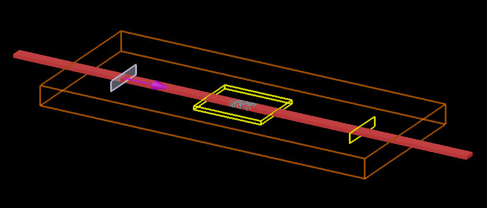

# GLOnet-LumericalAPI
 GLOnet https://github.com/jonfanlab/GLOnet interact with Lumerial FDTD solutions

### Task

A on-chip photonic grating design with GLOnet.

             

### State

Frame is OK.

To be evaluated by training & evaluating.